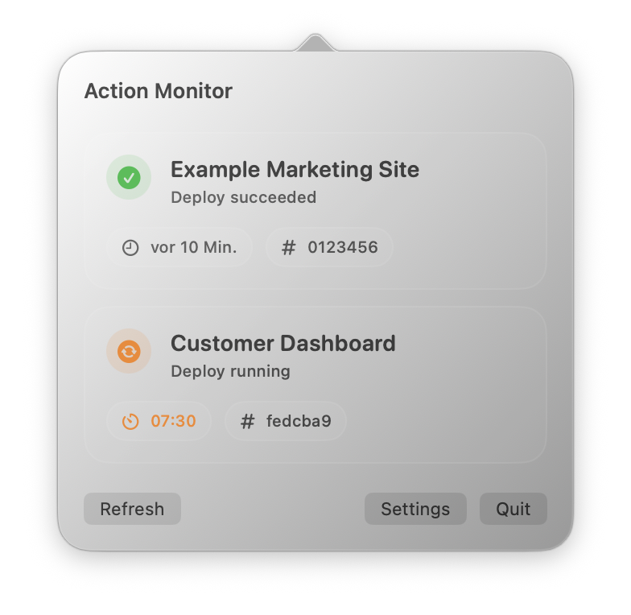

# actionMonitor

<p align="center">
  
</p>

`actionMonitor` is a macOS menu bar app for monitoring the GitHub Actions workflows you actually care about. Sign in with GitHub in the browser, choose the repositories this Mac is allowed to inspect, and keep a compact workflow status view in the menu bar.



## Features

- Monitor your own list of workflows instead of a hardcoded repository set
- Browser-based GitHub OAuth sign-in with PKCE and a loopback callback on `127.0.0.1`
- Repository selection for accounts that can access many repositories
- Guided onboarding for first launch
- Local workflow configuration stored on disk per Mac
- Demo mode for screenshots and manual QA

## Requirements

- macOS 14 or newer
- Xcode 16.3+ or Swift 6.1 command line tools for source builds

## Install

### Manual release install

1. Download the latest `actionMonitor-<version>-macos.zip` from GitHub Releases.
2. Extract `actionMonitor.app`.
3. Move `actionMonitor.app` to `/Applications`.
4. Launch the app.

`actionMonitor` is currently distributed as an unsigned app. If Gatekeeper blocks launch, open **System Settings > Privacy & Security** and allow the app to run, or remove quarantine manually:

```bash
xattr -d com.apple.quarantine "/Applications/actionMonitor.app"
```

The current packaged `v0.1.0` release was published without bundled shared OAuth credentials while those credentials are being re-issued. It works for public repository monitoring today; packaged private-repository browser sign-in can be re-enabled in a later rebuild once replacement shared credentials are ready.

### Homebrew cask install

Once this repository and its GitHub Releases are public, install through the published tap:

```bash
brew tap tintveen/tap
brew install --cask actionmonitor
```

The published tap lives at [tintveen/homebrew-tap](https://github.com/tintveen/homebrew-tap), and `Casks/actionmonitor.rb` in this repository remains the source copy used to update that tap.

### Build and install from source

```bash
./scripts/install-local.sh
```

This builds a release app bundle and installs it to `/Applications/actionMonitor.app`.

### Run from source

```bash
swift run actionMonitor
```

When launched via `swift run`, `actionMonitor` stores the GitHub session in `~/Library/Application Support/actionMonitor/github-oauth-session.json` so repeated terminal runs do not keep asking Keychain for approval.

Packaged `.app` installs use the macOS Keychain instead.

### Demo mode

```bash
swift run actionMonitor --demo
```

## First-run setup

1. Launch the app.
2. Complete onboarding.
3. Choose **Continue in Browser** to sign in with GitHub.
4. Confirm which accessible repositories this Mac can monitor.
5. Add your first workflow manually or from discovery.
6. Finish onboarding and refresh from the menu bar.

## GitHub access model

- Public repositories can be monitored without signing in.
- Private repository access currently uses a GitHub OAuth App with authorization code flow + PKCE.
- The app opens the system browser, listens on a temporary loopback callback such as `http://127.0.0.1:8123/callback`, validates the PKCE state, exchanges the code for a token, and stores the resulting session locally.
- Packaged app installs store the session in Keychain. `swift run` stores the session in `~/Library/Application Support/actionMonitor/github-oauth-session.json`.
- `actionMonitor` currently requests GitHub's `repo` scope for browser sign-in because private repository discovery and workflow polling require it. Public repository monitoring does not.

## OAuth configuration for source builds

The committed `Support/Info.plist` is intentionally blank for OAuth credentials.

If you want private-repository access while running from source, use one of these local-only options:

1. Set environment variables:

```bash
export ACTIONMONITOR_GITHUB_OAUTH_APP_CLIENT_ID="your-client-id"
export ACTIONMONITOR_GITHUB_OAUTH_APP_CLIENT_SECRET="your-client-secret"
swift run actionMonitor
```

2. Or create an untracked local plist:

```bash
cp Support/Info.local.example.plist Support/Info.local.plist
```

Then fill in your GitHub OAuth App credentials locally and run the app.

You can also point to a custom local plist path with `ACTIONMONITOR_GITHUB_OAUTH_INFO_PLIST=/absolute/path/to/Info.local.plist`.

`./scripts/install-local.sh` opts into `Support/Info.local.plist` automatically for local app installs. `./scripts/package-release.sh` does not; release packaging only uses environment variables or an explicitly provided plist path so a contributor's local dev credentials are not baked into release artifacts by accident.

## Packaging a release

Build the release app archive and generate Homebrew metadata:

```bash
./scripts/package-release.sh
```

This produces:

- `dist/actionMonitor-<version>-macos.zip`
- `dist/actionmonitor.rb`
- `dist/release-metadata.txt`

For release builds that should include GitHub OAuth credentials, provide them via environment variables at packaging time:

```bash
export ACTIONMONITOR_GITHUB_OAUTH_APP_CLIENT_ID="your-client-id"
export ACTIONMONITOR_GITHUB_OAUTH_APP_CLIENT_SECRET="your-client-secret"
./scripts/package-release.sh
```

If you intentionally want release packaging to read a local plist instead, pass it explicitly with `ACTIONMONITOR_GITHUB_OAUTH_INFO_PLIST=/absolute/path/to/Info.local.plist`.

This is a packaging convenience only. A distributed macOS app must still be treated as a public native client, and any shipped client secret should be assumed recoverable.

## Development

Run tests:

```bash
swift test
```

Run the local secret scan:

```bash
./scripts/check-secrets.sh
```

Remove the local app install:

```bash
./scripts/uninstall-local.sh
```

## Repository launch checklist

- [Public launch checklist](docs/public-launch-checklist.md)
- [Security policy](SECURITY.md)
- [Contributing guide](CONTRIBUTING.md)
- [Release notes template](docs/release-notes-template.md)

## Current release status

- Source builds are supported now
- Release packaging automation is included in `.github/workflows/release.yml`
- Homebrew cask metadata is generated from the packaged archive
- The first public release is intended to be unsigned and not notarized
