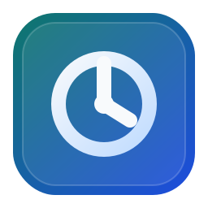
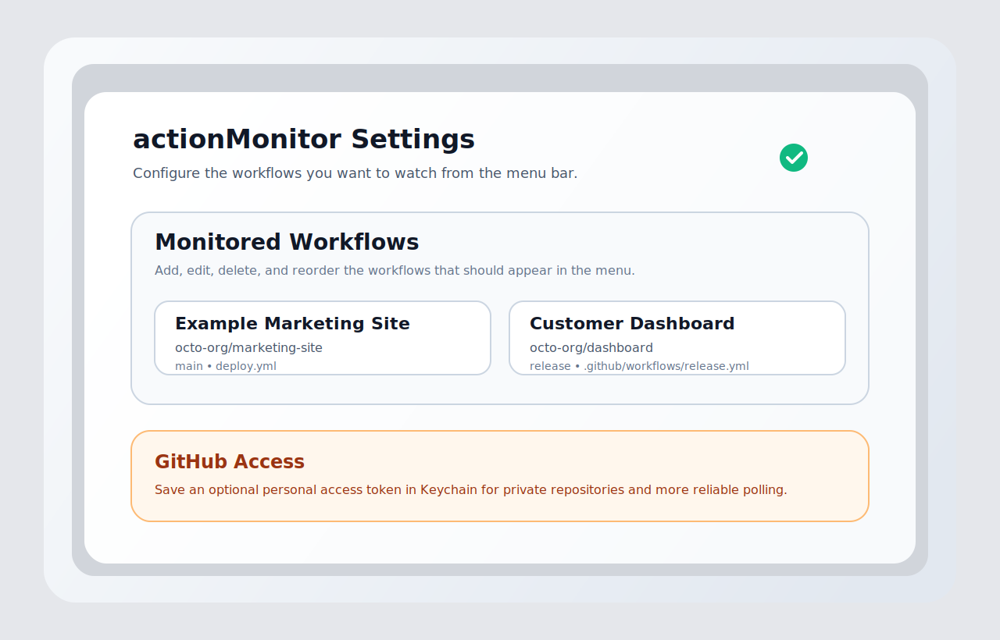

# actionMonitor



`actionMonitor` is a macOS menu bar app for watching GitHub Actions workflows that matter to you. Configure the repositories and workflow files you want to monitor, keep an optional GitHub token in Keychain, and get a compact status view from the menu bar.



## Features

- Monitor your own list of GitHub Actions workflows instead of a hardcoded repo list.
- Add, edit, delete, and reorder monitored workflows from the Settings window.
- Watch public repositories without a token, or save a GitHub token in Keychain for private repos and better rate-limit behavior.
- Keep workflow configuration on disk at `~/Library/Application Support/actionMonitor/monitored-workflows.json`.
- Use `--demo` on macOS to launch the app with sample workflows for screenshots or manual QA.

## Requirements

- macOS 14 or newer
- Xcode Command Line Tools or Xcode with Swift 6.1 support

## Build And Install

### Install locally

```bash
./scripts/install-local.sh
```

This builds a release app bundle and installs it to `~/Applications/actionMonitor.app`.

### Run from source

```bash
swift run actionMonitor
```

### Launch demo mode

```bash
swift run actionMonitor --demo
```

## First-Run Setup

1. Launch the app.
2. Open `Settings`.
3. Add one or more workflows with:
   - Display name
   - GitHub owner or organization
   - Repository name
   - Branch
   - Workflow file name or path
   - Optional site URL
4. Refresh from the menu bar to fetch the latest workflow run.

## GitHub Token Guidance

- Public repositories usually work without a token.
- Private repositories need a token that can read Actions workflow data.
- A token also helps avoid stricter anonymous GitHub rate limits.
- On macOS, the token is stored in Keychain by the app.

## Development

### Run tests

```bash
swift test
```

### Remove the local install

```bash
./scripts/uninstall-local.sh
```

## Release Notes

- Source distribution is the supported release format for now.
- The repository includes a macOS CI workflow that runs `swift test` on pushes and pull requests.
- The bundled app version is currently `0.1.0`.
